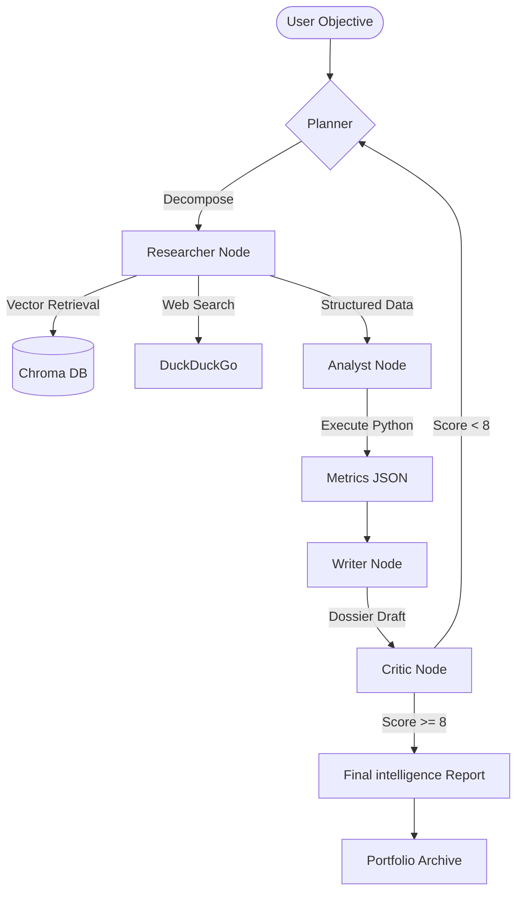

# Multi Agent AI | Research & Analytics Swarm

An advanced, autonomous multi-agent research system built with **LangGraph**, **LangChain**, and **Ollama**. This system coordinates a swarm of specialized AI agents to perform deep research, statistical analysis, and professional reporting entirely on local infrastructure.

## 🚀 Key Features (v4.0)

*   **Autonomous Swarm Intelligence**: 5 specialized agents (Planner, Researcher, Analyst, Writer, Critic).
*   **Structured Grounding**: Researcher extracts real-world data with precise citations.
*   **Computational Engine**: Analyst executes Python code for data processing and statistical validation.
*   **Critic Gauge telemetry**: Real-time quality scoring (0-10) with iterative feedback loops.
*   **Dynamic Analytics**: Streamlit Dashboard with Plotly visualization of research metrics.
*   **Intelligence Portfolio**: Automatic archiving of completed research missions.

## 🛠 Architectural Flow



## 📂 Project Structure

```
multi_agent_system/
├── app/
│   └── dashboard.py    # Premium Streamlit UI
├── src/
│   ├── agents.py       # Agent Node definitions
│   ├── state.py        # v4.0 State Schema
│   ├── tools.py        # Search & Python REPL
│   └── workflow.py     # LangGraph Logic
├── main.py             # CLI Entry Point
└── requirements.txt    # Dependencies
```

## ⚙️ Setup

1. **Install Ollama**: Download from [ollama.com](https://ollama.com/) and pull the model:
   ```bash
   ollama pull llama3.2:1b
   ```

2. **Clone & Install**:
   ```bash
   git clone <your-repo-url>
   cd multi_agent_system
   python -m venv venv
   source venv/bin/activate  # Windows: .\venv\Scripts\activate
   pip install -r requirements.txt
   ```

3. **Launch Dashboard**:
   ```bash
   streamlit run app/dashboard.py
   ```

---
*Powered by the Multi Agent AI Engine.*
